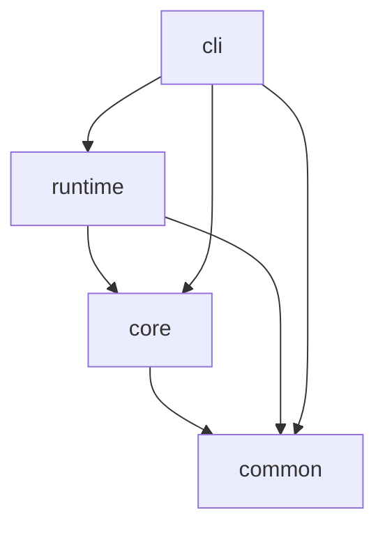
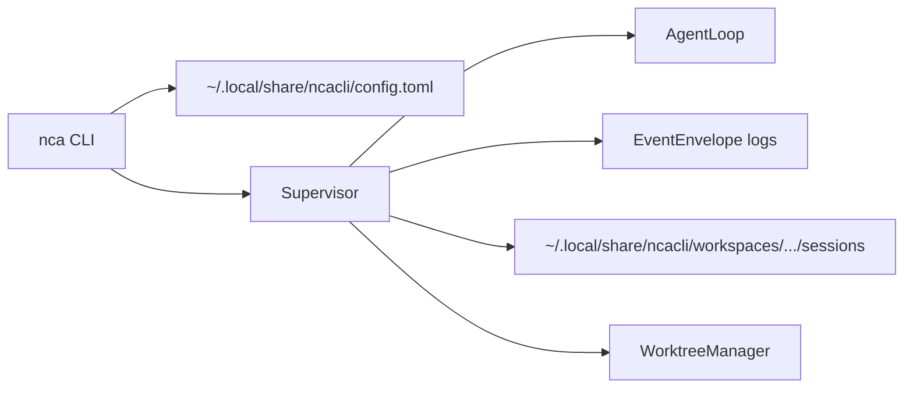
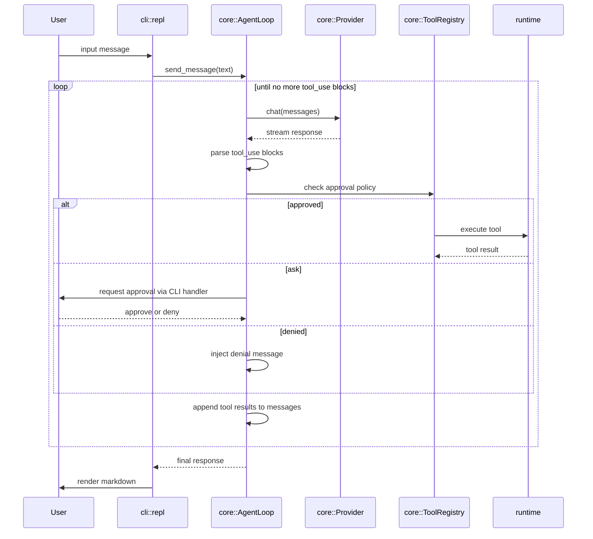
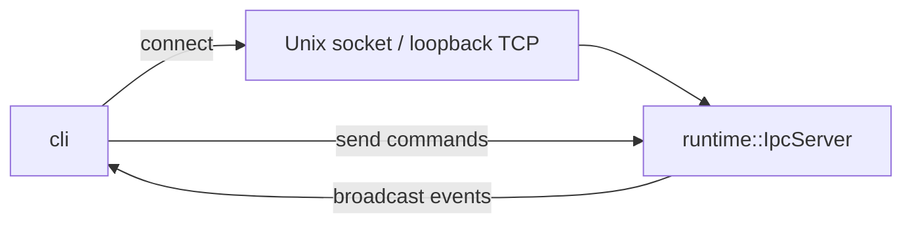
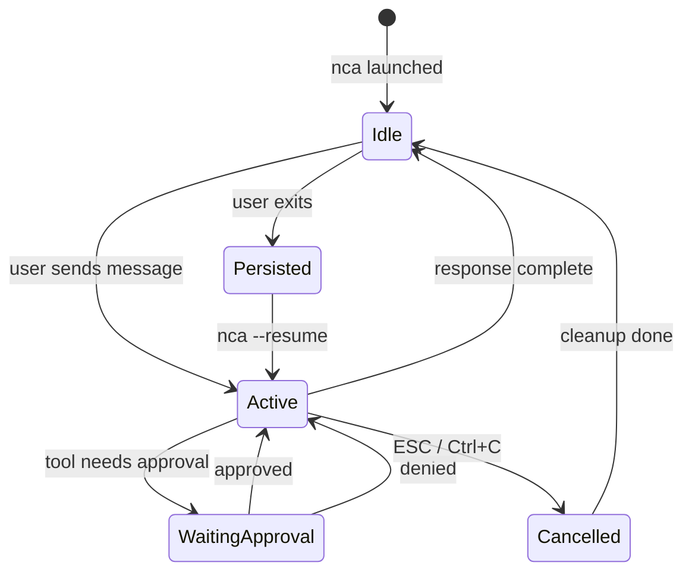

# Architecture

This document defines the crate boundaries, data flows, IPC model, security model, and session lifecycle for nca.

---

## Workspace Layout

```
native-cli-ai/
├── Cargo.toml              # workspace root
├── crates/
│   ├── common/             # shared config, messages, events, sessions, and tools
│   ├── core/               # agent loop, providers, harness, approvals, and tools
│   ├── runtime/            # supervision, persistence, IPC, worktrees, PTY, and context
│   ├── tui/                # full-screen TUI, REPL, composer, overlays, and rendering
│   ├── cli/                # nca binary entrypoint, Clap commands, streams, and glue
│   └── autoresearch/       # metric-driven research programs and experiment runner
│
├── docs/
│   ├── user/               # user-facing guides
│   ├── product/            # product requirements and roadmap
│   ├── reference/          # stable technical and CLI references
│   ├── design/             # implementation plans and feature specifications
│   ├── research/           # investigations and benchmarks
│   └── images/             # documentation assets
│
└── .cursor/
    └── rules/              # Cursor rules for AI-assisted development
```

---

## Crate Dependency Graph



The CLI delegates session lifecycle to the runtime `Supervisor`.

## CLI-first architecture

The terminal app (`nca`) is the primary interface. Session state and optional `NCA_ORCH_*` metadata stay local-first; use `nca` with JSON/NDJSON flags for automation.



### Key modules

- **`runtime::supervisor`**: Session lifecycle manager used by the CLI (`nca serve`, attach, spawn, etc.). Builds a `HarnessSnapshot` and refreshes the system prompt on create/resume/config and each turn.
- **`runtime::session_store`**: Persist and load session JSON under `~/.local/share/ncacli/workspaces/<id>/sessions/`.
- **`runtime::worktree`**: Isolated git worktree creation, cleanup, and merge per agent run.
- **`runtime::bash_tool`**: bounded shell-backed command execution, registered by the supervisor.
  `runtime::pty::PtyManager` additionally provides portable interactive PTY sessions.
- **`core::provider::custom`**: Protocol adapters for Custom OpenAI Chat Completions,
  OpenAI Responses, and Anthropic-compatible endpoints, including capability
  discovery, request construction, streaming, and protocol-specific failures.

### Evidence-bounded financial research

Each agent turn owns one immutable UTC calendar-date `as_of`. The harness, generic web evidence,
financial validation, cadence resolution, and structured output all consume that same value; source
retrieval and publication timestamps remain detailed provenance. The financial workflow is opt-in
through the `financial-research` skill. Generic web tools collect source-attributed evidence, while
the financial resolver owns issuer, period, authority, status, conflict, and fallback rules.
Generic `write_file` stays domain-neutral; `write_validated_financial_report` is the validation-aware
persistence path. Financial-looking final responses are annotated with the same
verification status and warning semantics before they reach human, JSON, or
NDJSON consumers. A resumed session begins a new turn boundary, so its
date-sensitive evidence is refreshed rather than inherited as an implicit
current date.

---

## Agent Loop

The central execution model is a **tool-use loop** driven by `core::agent::AgentLoop`.

The current default provider path is `MiniMaxProvider`, selected by `core::provider::factory`
from `common::config::NcaConfig`. The CLI resolves configuration from defaults, `~/.local/share/ncacli/config.toml`
(with legacy `~/.nca/config.toml` read fallback), `.nca/config.local.toml`, and environment variables such as `MINIMAX_API_KEY`.

The system prompt is layered by `core::harness::build_system_prompt` from a runtime-built `HarnessSnapshot`:

1. built-in identity + permission mode
2. the complete non-empty workspace-root `AGENTS.md` instruction block
3. project instructions (`.ncarc`)
4. local instructions (`.nca/instructions.md`)
5. skill summaries from the shared catalog
6. **Available Context** (cwd, git branch, model, permission mode, agent profile; contextual only)
7. **Todos** (capped session todo list; contextual only)
8. **Memory** (newest notes from the home workspace cache; contextual only)
9. optional orchestration metadata from `NCA_ORCH_*`
10. built-in tool and execution guidance; nca development instructions add the edit order (`replace_match` → `edit_file` → `apply_patch` → `write_file`)

The runtime reads `AGENTS.md` only at the configured workspace root. Its full
text is additive and is kept separate from the root-level `##` sections that
are projected into the skill catalog. `AgentLoop::set_system_prompt` replaces
the prior runtime-generated system message at index zero, so refreshes do not
accumulate duplicate prompts or duplicate conversation history. Resume loads
the persisted model, messages, todos, summaries, lineage, and worktree metadata
before the resumed session pointer is updated, then performs one prompt and
context initialization using the restored identity.



### Streaming

Provider responses are streamed token-by-token via `tokio::sync::mpsc`. MiniMax,
OpenAI-compatible Chat Completions, Custom Responses, and Anthropic-compatible
adapters map their wire-specific SSE events into the shared provider stream
contract. The CLI can render:

- human-readable live progress
- NDJSON `EventEnvelope` stream mode
- no stream, with only final output

Tool-use blocks are collected and executed by the registry until a final
assistant response is produced. Adapters map the tool loop back to their wire
protocol: Chat/Anthropic paths replay tool messages, while Custom Responses
uses native function-call and function-call-output items.

### Provider protocol and lifecycle invariants

Custom Responses requests use the configured path prefix plus `/responses`,
Bearer authentication, `stream: true`, `store: false`,
`max_output_tokens`, and optional nested `reasoning.effort`; configured
`temperature` is intentionally omitted. Native text/image input and nca
function tools are supported, while hosted tools, unsupported images, malformed
known events, invalid UTF-8, missing function-call identity/name/arguments, and
empty completions fail explicitly.

Responses function-call identities are normalized at the stream boundary. An
explicit `call_id` wins; a stable function-item ID or `output_index` is used as
the fallback key, allowing split arguments and rotating event IDs to remain
associated with the correct call and preserving stream order.

The permissive `model.reasoning_effort` setting is sent only to OpenAI-compatible
Chat/Responses requests: Chat uses the root `reasoning_effort` property and
Responses uses `reasoning.effort`. The literal `nil` or an empty value omits it;
Anthropic-compatible requests never receive the field.

When `NCA_DEBUG_REQUEST=1`, Custom Chat and Responses adapters append the final
redacted request to `./debug.log` and warn on stderr if the log cannot be
written. Response bodies, streams, parsed events, errors, tool output, and
completion text are never written to the diagnostic log.

### TUI transcript rendering

`nca-tui` renders completed and streaming assistant blocks through the same
native Markdown path. The renderer buffers tables for compact aligned columns,
wraps cells and highlighted code to display-cell width, styles common inline
and block constructs, and uses visible fallbacks for malformed or unsupported
content. It does not alter raw message content, persisted sessions, replay, or
clipboard output.

### Goal loop and capability gates

Interactive `/goal` is a YOLO-only loop over ordinary agent turns and the
existing todo/event seams; it does not add an IPC command, goal event variant,
or persisted active-goal protocol. Fresh goals reset the todo list, continuation
goals reuse incomplete todos, and cancellation, provider/tool failure, no
progress, or the outer iteration cap produce an explicit incomplete result.
`TodosUpdated` is a full-list replacement event and is therefore part of goal
replay and resume behavior.

Financial report tools are registered behind the existing tool registry but are
hidden until the `financial-research` skill is explicitly invoked, except for
YOLO sessions. The validated writer remains in the full/write tool set and
requires an official, current-turn validated report before touching the target
file.

### Search and edit flow

The default local search/edit loop is intentionally lightweight and Rust-native:

- `core::tools::search::SearchCodeTool` shells out to `rg --json` and returns structured JSON matches with file path, line, column, matched text, and optional context lines.
- `core::code_intel::FastLocalCodeIntel` provides fast Rust symbol lookup via literal-name search instead of passing raw user regex into symbol patterns.
- `core::tools::edit_file::EditFileTool` and `core::tools::apply_patch::ApplyPatchTool` still perform exact string replacement, but now reject ambiguous single-match edits and require `replace_all` or a more precise targeting flow.
- `core::tools::replace_match::ReplaceMatchTool` is the bridge between search and editing: it replaces a specific match at exact `path`, `line`, and `column` coordinates.

This keeps the current architecture simple: ripgrep remains the matcher, while the tool contract becomes structured enough for safer agent behavior without introducing a full local search index yet.

---

## IPC and Event Bus

The runtime exposes one newline-delimited JSON endpoint per session. Unix uses a domain socket at
`$XDG_RUNTIME_DIR/nca/<session-id>.sock` (or the system temporary directory as fallback). Windows
uses a loopback TCP endpoint selected by the operating system, with collision-safe allocation.
Running sessions persist the actual endpoint in session metadata, so attach, cancel, and serve do
not need to reconstruct a port from the session ID.

### Protocol

- **Transport**: Unix domain stream socket on Unix; loopback TCP on Windows. Both use newline-delimited JSON.
- **Direction**: The runtime is the server. The CLI (e.g. `nca attach`) connects as a client.
- **Messages**: Every `AgentEvent` from `common::event` is wrapped in `EventEnvelope` and serialized to all connected clients. Persisted logs and live IPC use the same machine-readable shape.
- **Endpoint publication**: The server binds before publishing session metadata. Windows endpoints are
  allocated with an ephemeral loopback port and are retried if the OS reports a bind collision.



### Event Schema (common::event)

```rust
pub enum AgentEvent {
    SessionStarted { session_id: String, workspace: PathBuf, model: String },
    MessageReceived { role: Role, content: String },
    TokensStreamed { delta: String },
    ToolCallStarted { call_id: String, tool: String, input: serde_json::Value },
    ToolCallCompleted { call_id: String, output: ToolResult },
    ApprovalRequested { call_id: String, tool: String, description: String },
    ApprovalResolved { call_id: String, approved: bool },
    CostUpdated { input_tokens: u64, output_tokens: u64, estimated_cost_usd: f64 },
    Checkpoint { phase: String, detail: String, turn: u32 },
    SessionEnded { reason: EndReason },
    Error { message: String },
    Response { response: AgentResponse },
    ChildSessionSpawned { parent_session_id: String, child_session_id: String, task: String, workspace: PathBuf, branch: Option<String> },
    ChildSessionCompleted { parent_session_id: String, child_session_id: String, status: String },
    QuestionRequested { question: InteractiveQuestionPayload },
    QuestionResolved { question_id: String, selection: QuestionSelection },
    TodosUpdated { todos: Vec<AgentTodo> },
}
```

`InteractiveQuestionPayload` carries `question_id`, `call_id`, `prompt`, `options` (`id` + `label`), `allow_custom`, and `suggested_answer` (always present for fast accept). `QuestionSelection` is an internal tagged enum: `suggested`, `option { option_id }`, or `custom { text }`.

### Command Schema

```rust
pub enum AgentCommand {
    SendMessage { content: String },
    ApproveToolCall { call_id: String },
    DenyToolCall { call_id: String },
    AnswerQuestion { question_id: String, selection: QuestionSelection },
    Cancel,
    Shutdown,
}
```

---

## PTY and Process Execution

### Sandboxed Bash

`runtime::pty::PtyManager` provides both bounded shell-backed command execution and
platform-native interactive PTY sessions. Its command-execution path:

1. Spawn the platform's configured command shell confined to the workspace root (via `chdir`); interactive callers use `portable-pty` for a real PTY.
2. Capture stdout/stderr as structured output.
3. Enforce a timeout (default 30s, configurable).
4. Terminate the process using platform-native process APIs on cancellation or timeout.

### Permission Check Flow

```
User request -> Agent proposes bash tool call
  -> core::approval checks command against config tiers:
     allowed_commands: ["cargo", "npm", "go", "ls", "cat", "grep", "git status", ...]
     denied_commands:  ["rm", "sudo", "chmod", "kill", "shutdown", ...]
     ask_commands:     [everything else]
  -> If "ask": prompt through the active approval handler
  -> If approved: runtime-backed bash executor runs command in workspace
  -> Result streamed back as ToolResult
```

## Session Commands

The CLI now exposes multiple session surfaces on top of the same engine:

- `run` for explicit one-shot execution
- `--run` for Claude-style interactive run mode
- `serve` for long-lived IPC-controlled sessions
- `spawn` for background execution
- `sessions` for saved-session listing
- `resume` for continuing a saved session
- `logs` for replaying structured event output
- `attach` for live event replay over IPC
- `status` for session metadata
- `cancel` for stopping a running session

## Permission Modes

The CLI supports explicit permission handling modes:

- `default` for read/web tools auto-allowed, edits and commands ask
- `plan` for analysis/research only
- `accept-edits` for auto-accepted file edits with command caution
- `dont-ask` for readonly-only automatic execution
- `bypass-permissions` for fully trusted environments

---

## Tmux Adapter (Phase 3)

`runtime::tmux::TmuxAdapter` wraps `tmux_interface` behind a trait:

```rust
#[async_trait]
pub trait MultiplexerAdapter: Send + Sync {
    async fn create_session(&self, name: &str, cwd: &Path) -> Result<SessionHandle>;
    async fn attach(&self, handle: &SessionHandle) -> Result<()>;
    async fn detach(&self, handle: &SessionHandle) -> Result<()>;
    async fn send_keys(&self, handle: &SessionHandle, keys: &str) -> Result<()>;
    async fn capture_pane(&self, handle: &SessionHandle) -> Result<String>;
    async fn kill_session(&self, handle: &SessionHandle) -> Result<()>;
}
```

This trait allows swapping tmux for zellij or a built-in multiplexer later.

---

## Session Model

### Persistence

Sessions are stored as JSON files under `~/.local/share/ncacli/workspaces/<workspace-id>/sessions/<session-id>.json`:

```json
{
  "id": "a1b2c3",
  "created_at": "2026-03-11T10:00:00Z",
  "updated_at": "2026-03-11T10:15:00Z",
  "workspace": "/home/user/project",
  "model": "claude-sonnet-4-5",
  "messages": [ ... ],
  "total_input_tokens": 12500,
  "total_output_tokens": 8300,
  "estimated_cost_usd": 0.042
}
```

Persistence is per-workspace under the product home:

- `~/.local/share/ncacli/workspaces/<id>/sessions/*.json` stores session snapshots and conversation state.
- `~/.local/share/ncacli/workspaces/<id>/sessions/*.events.jsonl` stores append-only event streams for replay and live attach.
- Git worktrees remain under `<repo>/.nca/worktrees/` (repo-coupled).

### Lifecycle



---

## Security Model

### Workspace Sandbox

```
workspace_root/
├── .nca/                    # nca data (sessions, config, instructions)
│   ├── config.local.toml    # gitignored, local overrides
│   ├── instructions.md      # personal instructions
│   └── sessions/
├── .ncarc                   # project-wide instructions (version controlled)
├── src/                     # project source -- full read/write access
└── ...
```

- **Inside workspace**: Read and write allowed by default.
- **Outside workspace**: Read only if explicitly allowed in config. Write always denied.
- **Home directory config**: product home config (`$NCA_HOME`, `$XDG_DATA_HOME/ncacli`, or `~/.local/share/ncacli/config.toml`) for global defaults.

### Threat Model

| Threat | Mitigation |
|--------|-----------|
| LLM instructs destructive command | Tiered approval system; destructive commands in deny list |
| LLM writes outside workspace | Path canonicalization + workspace root check before every write |
| LLM exfiltrates secrets via bash | Bash runs in PTY with no inherited env vars beyond explicit allowlist |
| Malicious MCP server | MCP server commands are not covered by workspace sandbox; documented as user responsibility |
| Session file tampering | Sessions are local-only; no remote sync in MVP |

---

## Config Resolution Order

Config values are resolved with later sources overriding earlier ones:

1. Compiled defaults
2. `~/.local/share/ncacli/config.toml` (global; legacy `~/.nca/config.toml` read fallback)
3. `.nca/config.local.toml` (workspace, gitignored)
4. Environment variables such as `MINIMAX_API_KEY`, provider-specific API-key variables, `NCA_MODEL`, and `NCA_HOME`
5. CLI flags (`--model`, `--safe`, `--verbose`)

---

## Performance Design Principles

See [Rust/Ratatui Optimization Research](../research/rust-ratatui-optimization.md) for detailed analysis and benchmarks.

### Key Optimization Patterns

**Dirty Flag Rendering**: Ratatui's default behavior redraws at 60 FPS even for static content, causing 7%+ CPU usage in release builds. The solution is event-driven rendering:

```rust
// Only render when state actually changes
if app.is_dirty() {
    terminal.draw(|f| app.render(f));
    app.clear_dirty();
}
```

**Bounded Channels for Backpressure**: Unbounded IPC channels can accumulate infinite messages during load spikes. Use bounded channels to create natural backpressure:

```rust
// Bounded channel: sender blocks when buffer full
let (tx, rx) = tokio::sync::mpsc::channel(100);
```

**Preallocate Collections**: Vec growth involves heap allocation. Preallocate when size is known:

```rust
let mut rows = Vec::with_capacity(width);
for _ in 0..width {
    rows.push(Row::with_capacity(height));
}
```

### Binary Size Optimization

Release builds should use aggressive size optimization:

```toml
[profile.release]
opt-level = "z"        # Optimize for size
lto = true             # Link-time optimization
codegen-units = 1      # Single unit for max optimization
strip = true           # Remove symbols
panic = "abort"         # Smaller panic handling
```

**Expected impact**: 40-50% binary size reduction vs default release build.

### Performance Targets

| Metric | Target | Reference |
|--------|--------|-----------|
| Idle CPU | <1% | Ratatui issue #1338 shows 7% baseline |
| Active typing CPU | <5% | Per-char renders should be minimal |
| Binary size | <5 MB | Current measurement needed |
| Cold start | <100ms | |

---

## Build and Distribution

- **Dev**: `cargo run -p nca-cli`
- **Release**: `cargo build --release` produces `nca` (CLI).
- **Size-optimized**: `cargo build --profile release-opt-size` (uses `release-opt-size` profile if defined).
- **Install**: `cargo install --path crates/cli`.
- **CI**: GitHub Actions with `cargo test --workspace`, `cargo clippy --workspace`, `cargo fmt --check`.
- **Cross-compile**: Target `x86_64-unknown-linux-musl` for static Linux binaries. macOS and Windows use default targets.
